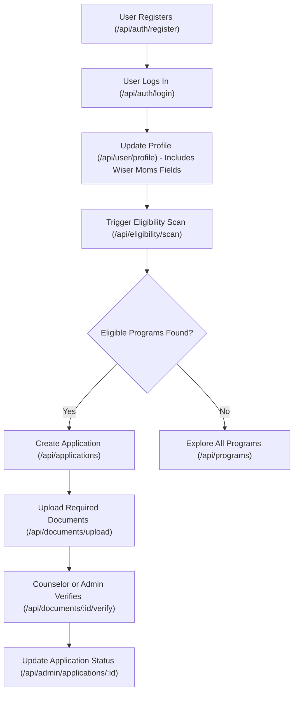

# MomPlan AI Benefits Platform - API Technical Specification

This document provides the technical requirements, schema definitions, and endpoint specs for the MomPlan REST API.

---

## 1. Global API Conventions

### Base URL
- Development: `http://localhost:5000/api`
- Production: `https://api.momplan.com/api` (or configured via backend environment)

### Security Headers
Every API response includes the following headers via `helmet`:
- `Content-Security-Policy`
- `Strict-Transport-Security` (HSTS)
- `X-Frame-Options: SAMEORIGIN`
- `X-Content-Type-Options: nosniff`
- `Referrer-Policy: no-referrer`

### Cross-Origin Resource Sharing (CORS)
CORS is restricted strictly to permitted client applications:
- Users Portal: `FRONTEND_URL`
- Admin Portal: `ADMIN_FRONTEND_URL`
- Custom pre-flight options are active with `credentials: true`.

---

## 2. Authentication & Authorization

### JWT Token Standard
MomPlan uses JSON Web Tokens (JWT) for authentication. After logging in, the client receives an Access Token (short-lived) and a Refresh Token (longer-lived).
- **Format**: `Authorization: Bearer <JWT_ACCESS_TOKEN>`

### User Roles & Access Control
Each user belongs to one of three roles, which are verified by route guards (`authorizeRoles`):
1. **`user`**: Standard portal user. Access is restricted to their own profile, family context, scans, applications, and documents.
2. **`counselor`**: Counselors who assist users. Access includes user document verification and counseling sessions.
3. **`admin`**: System administrators. Full access to user management, program configurations, audit logs, and global analytics.

### Global Error Response Format
All errors return a standardized JSON structure:
```json
{
  "success": false,
  "error": {
    "code": "BAD_REQUEST",
    "message": "Detailed error message explaining the failure.",
    "details": []
  }
}
```

---

## 3. Workflow Architecture

This diagram illustrates the lifecycle of a user profile update, eligibility scanning, and counselor/admin verification:



---

## 4. REST API Endpoint Catalog

---

### 4.1 Authentication (`/api/auth`)

#### `POST /api/auth/register`
Creates a new user profile.
*   **Access**: Public
*   **Request Body**:
    ```json
    {
      "email": "user@example.com",
      "password": "strongpassword123",
      "full_name": "Jane Doe",
      "phone": "+15551234567"
    }
    ```
*   **Response (201 Created)**:
    ```json
    {
      "success": true,
      "data": {
        "id": "e22a445d-4f18-4c91-923f-45b0a68d0bb1",
        "email": "user@example.com",
        "full_name": "Jane Doe",
        "role": "user",
        "plan": "free"
      }
    }
    ```

#### `POST /api/auth/login`
Authenticates user and issues access/refresh tokens.
*   **Access**: Public (Subject to Rate Limiting)
*   **Request Body**:
    ```json
    {
      "email": "user@example.com",
      "password": "strongpassword123"
    }
    ```
*   **Response (200 OK)**:
    ```json
    {
      "success": true,
      "data": {
        "accessToken": "eyJhbGciOi...",
        "refreshToken": "eyJhbGciOi...",
        "user": {
          "id": "e22a445d-4f18-4c91-923f-45b0a68d0bb1",
          "email": "user@example.com",
          "full_name": "Jane Doe",
          "role": "user"
        }
      }
    }
    ```

#### `POST /api/auth/refresh`
Refreshes an expired access token using a valid refresh token.
*   **Access**: Public
*   **Request Body**:
    ```json
    {
      "refreshToken": "eyJhbGciOi..."
    }
    ```
*   **Response (200 OK)**:
    ```json
    {
      "success": true,
      "data": {
        "accessToken": "eyJhbGciOi..."
      }
    }
    ```

#### `POST /api/auth/logout`
Logs out the user and invalidates their session.
*   **Access**: Authenticated (`user` | `admin` | `counselor`)
*   **Response (200 OK)**:
    ```json
    {
      "success": true,
      "message": "Logged out successfully"
    }
    ```

#### `POST /api/auth/forgot-password`
Initiates a password reset email sequence.
*   **Access**: Public
*   **Request Body**:
    ```json
    {
      "email": "user@example.com"
    }
    ```
*   **Response (200 OK)**:
    ```json
    {
      "success": true,
      "message": "If this email is registered, a password reset link has been sent."
    }
    ```

#### `POST /api/auth/reset-password`
Completes password reset using verification token.
*   **Access**: Public
*   **Request Body**:
    ```json
    {
      "token": "reset-token-received-in-email",
      "newPassword": "newSecurePassword123!"
    }
    ```
*   **Response (200 OK)**:
    ```json
    {
      "success": true,
      "message": "Password reset successfully."
    }
    ```

---

### 4.2 User Profiles (`/api/user`)

#### `GET /api/user/profile`
Fetches current logged-in user profile detail.
*   **Access**: Authenticated
*   **Response (200 OK)**:
    ```json
    {
      "success": true,
      "data": {
        "id": "e22a445d-4f18-4c91-923f-45b0a68d0bb1",
        "email": "user@example.com",
        "full_name": "Jane Doe",
        "phone": "+15551234567",
        "role": "user",
        "plan": "free",
        "state": "CA",
        "zip_code": "90210",
        "status": "active"
      }
    }
    ```

#### `PUT /api/user/profile`
Updates user details and profiles, incorporating expanded fields for eligibility checks.
*   **Access**: Authenticated
*   **Request Body** (All fields optional):
    ```json
    {
      "full_name": "Jane Doe Updated",
      "phone": "+15557654321",
      "state": "NY",
      "zip_code": "10001",
      "household_size": 3,
      "num_children": 2,
      "children_ages": [3, 5],
      "monthly_income": 3500.00,
      "employment_status": "employed",
      "housing_status": "renting",
      "has_disability": false,
      "is_pregnant": false,
      "needs_childcare": true,
      "monthly_rent": 1200.00,
      "eviction_risk": false,
      "domestic_violence": false,
      "chronic_illness": false,
      "immigration_status": "citizen",
      "date_of_birth": "1990-05-15",
      "preferred_language": "English",
      "marital_status": "married",
      "other_adults": false,
      "income_sources": ["wages"],
      "work_situation": "full-time",
      "health_insurance": "private",
      "savings_assets": "low",
      "child_support_status": "none"
    }
    ```
*   **Response (200 OK)**:
    ```json
    {
      "success": true,
      "data": {
        "id": "e22a445d-4f18-4c91-923f-45b0a68d0bb1",
        "full_name": "Jane Doe Updated",
        "state": "NY",
        "zip_code": "10001"
      }
    }
    ```

#### `GET /api/user/family-profile`
Fetches household specific indicators.
*   **Access**: Authenticated
*   **Response (200 OK)**:
    ```json
    {
      "success": true,
      "data": {
        "household_size": 3,
        "num_children": 2,
        "children_ages": [3, 5],
        "monthly_income": 3500,
        "employment_status": "employed",
        "housing_status": "renting",
        "has_disability": false,
        "is_pregnant": false
      }
    }
    ```

#### `PUT /api/user/family-profile`
Updates strictly constrained family demographics.
*   **Access**: Authenticated
*   **Request Body**:
    ```json
    {
      "household_size": 4,
      "num_children": 3,
      "children_ages": [1, 4, 6],
      "monthly_income": 4000.00,
      "employment_status": "employed",
      "housing_status": "renting",
      "has_disability": false,
      "is_pregnant": true
    }
    ```
*   **Response (200 OK)**:
    ```json
    {
      "success": true,
      "data": {
        "household_size": 4,
        "num_children": 3
      }
    }
    ```

---

### 4.3 Eligibility Engine (`/api/eligibility`)

#### `POST /api/eligibility/scan`
Evaluates user's complete profile/family parameters against all active benefit program criteria in the database and updates/inserts results.
*   **Access**: Authenticated
*   **Response (200 OK)**:
    ```json
    {
      "success": true,
      "data": [
        {
          "program_id": "prog-uuid-8899",
          "program_name": "SNAP NY",
          "status": "qualified",
          "confidence_score": 95.5,
          "reasoning": "Household size of 4 with income $4,000 is below the SNAP threshold of $4,300."
        },
        {
          "program_id": "prog-uuid-4433",
          "program_name": "Medicaid NY",
          "status": "likely_qualified",
          "confidence_score": 82.0,
          "reasoning": "Pregnant applicant qualifies under state expansion limits pending SSN/residency verification."
        }
      ]
    }
    ```

#### `GET /api/eligibility/results`
Returns previously saved scan scores for the active user.
*   **Access**: Authenticated
*   **Response (200 OK)**:
    ```json
    {
      "success": true,
      "data": [
        {
          "id": "result-uuid-001",
          "program_id": "prog-uuid-8899",
          "status": "qualified",
          "confidence_score": 95.5,
          "reasoning": "Household size of 4...",
          "checked_at": "2026-05-21T17:00:00Z"
        }
      ]
    }
    ```

#### `GET /api/eligibility/results/:programId`
Fetch results for a single program check.
*   **Access**: Authenticated
*   **Response (200 OK)**:
    ```json
    {
      "success": true,
      "data": {
        "program_id": "prog-uuid-8899",
        "status": "qualified",
        "confidence_score": 95.5,
        "reasoning": "Household size of 4..."
      }
    }
    ```

---

### 4.4 Benefit Programs (`/api/programs`)

#### `GET /api/programs`
List available benefit programs. Supports optional geographic/state and categorical filter queries.
*   **Access**: Public
*   **Query Parameters**:
    *   `state` (optional): state code (e.g. `NY`)
    *   `type` (optional): program type (e.g. `food`, `healthcare`)
*   **Response (200 OK)**:
    ```json
    {
      "success": true,
      "data": [
        {
          "id": "prog-uuid-8899",
          "name": "SNAP NY",
          "agency": "OTDA",
          "program_type": "food",
          "federal_or_state": "state",
          "state_code": "NY",
          "description": "Supplemental Nutrition Assistance Program",
          "estimated_monthly_value_min": 200.0,
          "estimated_monthly_value_max": 750.0
        }
      ]
    }
    ```

#### `GET /api/programs/:id`
Fetches a single benefit program configuration.
*   **Access**: Public
*   **Response (200 OK)**:
    ```json
    {
      "success": true,
      "data": {
        "id": "prog-uuid-8899",
        "name": "SNAP NY",
        "agency": "OTDA",
        "description": "...",
        "eligibility_criteria": {
          "max_income_multiplier": 1.3,
          "requires_citizenship": true
        }
      }
    }
    ```

#### `POST /api/programs`
Creates a new program configuration.
*   **Access**: Admin Only
*   **Request Body**:
    ```json
    {
      "name": "WIC Expansion",
      "agency": "DOH",
      "program_type": "health",
      "federal_or_state": "state",
      "state_code": "NY",
      "description": "Women, Infants, and Children food supplement program.",
      "eligibility_criteria": {
        "max_income_monthly": 3200,
        "max_child_age": 5
      },
      "estimated_monthly_value_min": 50,
      "estimated_monthly_value_max": 150,
      "application_url": "https://wic.ny.gov",
      "is_active": true
    }
    ```
*   **Response (201 Created)**:
    ```json
    {
      "success": true,
      "data": {
        "id": "prog-uuid-5566"
      }
    }
    ```

#### `PUT /api/programs/:id`
Updates an existing benefit program profile.
*   **Access**: Admin Only
*   **Request Body** (All fields optional):
    ```json
    {
      "name": "Updated Program Title",
      "is_active": false
    }
    ```
*   **Response (200 OK)**:
    ```json
    {
      "success": true,
      "data": {
        "id": "prog-uuid-5566",
        "name": "Updated Program Title"
      }
    }
    ```

#### `DELETE /api/programs/:id`
Deletes a benefit program from the database.
*   **Access**: Admin Only
*   **Response (200 OK)**:
    ```json
    {
      "success": true,
      "message": "Program deleted successfully"
    }
    ```

---

### 4.5 Applications (`/api/applications`)

#### `GET /api/applications`
List user's benefit applications.
*   **Access**: Authenticated
*   **Response (200 OK)**:
    ```json
    {
      "success": true,
      "data": [
        {
          "id": "app-uuid-1122",
          "program_id": "prog-uuid-8899",
          "status": "draft",
          "priority": "normal",
          "last_updated_at": "2026-05-21T12:00:00Z"
        }
      ]
    }
    ```

#### `POST /api/applications`
Creates a benefit program application record in draft status.
*   **Access**: Authenticated
*   **Request Body**:
    ```json
    {
      "program_id": "prog-uuid-8899",
      "notes": "Applying for food security assistance.",
      "priority": "normal"
    }
    ```
*   **Response (201 Created)**:
    ```json
    {
      "success": true,
      "data": {
        "id": "app-uuid-1122",
        "program_id": "prog-uuid-8899",
        "status": "draft"
      }
    }
    ```

#### `GET /api/applications/:id`
Fetch single application details.
*   **Access**: Authenticated
*   **Response (200 OK)**:
    ```json
    {
      "success": true,
      "data": {
        "id": "app-uuid-1122",
        "program_id": "prog-uuid-8899",
        "status": "draft",
        "priority": "normal",
        "notes": "Applying for food security assistance.",
        "documents": []
      }
    }
    ```

#### `PUT /api/applications/:id`
Updates user application (e.g. submit draft, cancel/withdraw, add notes).
*   **Access**: Authenticated
*   **Request Body**:
    ```json
    {
      "status": "submitted",
      "notes": "Included additional income proof."
    }
    ```
*   **Response (200 OK)**:
    ```json
    {
      "success": true,
      "data": {
        "id": "app-uuid-1122",
        "status": "submitted"
      }
    }
    ```

#### `DELETE /api/applications/:id`
Removes an application in draft state.
*   **Access**: Authenticated
*   **Response (200 OK)**:
    ```json
    {
      "success": true,
      "message": "Application deleted successfully"
    }
    ```

---

### 4.6 Documents (`/api/documents`)

#### `GET /api/documents`
Lists documents uploaded by the user. If called by counselor/admin, lists accessible documents.
*   **Access**: Authenticated
*   **Response (200 OK)**:
    ```json
    {
      "success": true,
      "data": [
        {
          "id": "doc-uuid-9900",
          "document_type": "proof_of_income",
          "file_name": "paystub.pdf",
          "verified": false
        }
      ]
    }
    ```

#### `POST /api/documents/upload`
Uploads a binary document using `multipart/form-data`. Handled using `multer` memory buffers and stored securely in AWS S3.
*   **Access**: Authenticated
*   **Request Format**: `multipart/form-data`
*   **Fields**:
    *   `file` (Binary File, max 10MB, allowed types: `pdf`, `jpeg`, `png`, `jpg`)
    *   `document_type` (String, e.g. `proof_of_income`, `birth_certificate`)
    *   `application_id` (String, Optional)
*   **Response (201 Created)**:
    ```json
    {
      "success": true,
      "data": {
        "id": "doc-uuid-9900",
        "document_type": "proof_of_income",
        "file_name": "paystub.pdf",
        "file_url": "https://momplan-docs.s3.amazonaws.com/uploads/paystub.pdf",
        "verified": false
      }
    }
    ```

#### `GET /api/documents/:id`
Fetch details of a single document.
*   **Access**: Authenticated
*   **Response (200 OK)**:
    ```json
    {
      "success": true,
      "data": {
        "id": "doc-uuid-9900",
        "file_name": "paystub.pdf",
        "file_url": "...",
        "verified": false
      }
    }
    ```

#### `DELETE /api/documents/:id`
Deletes a document.
*   **Access**: Authenticated
*   **Response (200 OK)**:
    ```json
    {
      "success": true,
      "message": "Document deleted successfully"
    }
    ```

#### `PUT /api/documents/:id/verify`
Marks a user's uploaded document as verified.
*   **Access**: Counselor or Admin
*   **Response (200 OK)**:
    ```json
    {
      "success": true,
      "data": {
        "id": "doc-uuid-9900",
        "verified": true,
        "verified_by": "admin-uuid-001"
      }
    }
    ```

---

### 4.7 Notifications (`/api/notifications`)

#### `GET /api/notifications`
Fetches a list of notifications for the authenticated user.
*   **Access**: Authenticated
*   **Response (200 OK)**:
    ```json
    {
      "success": true,
      "data": [
        {
          "id": "notif-uuid-1",
          "type": "deadline",
          "title": "Renewal Approaching",
          "message": "Your SNAP application needs renewal in 5 days.",
          "is_read": false,
          "created_at": "2026-05-21T10:00:00Z"
        }
      ]
    }
    ```

#### `PUT /api/notifications/read-all`
Marks all notifications of the user as read.
*   **Access**: Authenticated
*   **Response (200 OK)**:
    ```json
    {
      "success": true,
      "message": "All notifications marked as read"
    }
    ```

#### `PUT /api/notifications/:id/read`
Marks a single notification as read.
*   **Access**: Authenticated
*   **Response (200 OK)**:
    ```json
    {
      "success": true,
      "data": {
        "id": "notif-uuid-1",
        "is_read": true
      }
    }
    ```

#### `DELETE /api/notifications/:id`
Deletes a notification.
*   **Access**: Authenticated
*   **Response (200 OK)**:
    ```json
    {
      "success": true,
      "message": "Notification deleted successfully"
    }
    ```

---

### 4.8 Deadlines (`/api/deadlines`)

#### `GET /api/deadlines`
Lists all active deadlines for the user.
*   **Access**: Authenticated
*   **Response (200 OK)**:
    ```json
    {
      "success": true,
      "data": [
        {
          "id": "deadline-uuid-1",
          "deadline_type": "document_upload",
          "due_date": "2026-05-26T23:59:59Z",
          "is_completed": false
        }
      ]
    }
    ```

#### `POST /api/deadlines`
Manually tracks a new deadline relative to an application.
*   **Access**: Authenticated
*   **Request Body**:
    ```json
    {
      "application_id": "app-uuid-1122",
      "deadline_type": "renewal",
      "due_date": "2026-06-30T00:00:00Z"
    }
    ```
*   **Response (201 Created)**:
    ```json
    {
      "success": true,
      "data": {
        "id": "deadline-uuid-2",
        "deadline_type": "renewal",
        "due_date": "2026-06-30T00:00:00Z"
      }
    }
    ```

#### `PUT /api/deadlines/:id/complete`
Marks a deadline task as fulfilled.
*   **Access**: Authenticated
*   **Response (200 OK)**:
    ```json
    {
      "success": true,
      "data": {
        "id": "deadline-uuid-1",
        "is_completed": true
      }
    }
    ```

---

### 4.9 Counselor Sessions (`/api/sessions`)

#### `GET /api/sessions`
Lists scheduled counseling meetings.
*   **Access**: Authenticated
*   **Response (200 OK)**:
    ```json
    {
      "success": true,
      "data": [
        {
          "id": "session-uuid-1",
          "counselor_id": "counselor-uuid-444",
          "scheduled_at": "2026-05-25T14:00:00Z",
          "duration_minutes": 30,
          "status": "scheduled",
          "meeting_url": "https://meet.google.com/abc-defg-hij"
        }
      ]
    }
    ```

#### `POST /api/sessions/book`
Books a session with a designated counselor.
*   **Access**: Authenticated
*   **Request Body**:
    ```json
    {
      "counselor_id": "counselor-uuid-444",
      "scheduled_at": "2026-05-25T14:00:00Z",
      "duration_minutes": 30,
      "notes": "Need help reviewing SNAP proof of income documents."
    }
    ```
*   **Response (201 Created)**:
    ```json
    {
      "success": true,
      "data": {
        "id": "session-uuid-2",
        "status": "scheduled"
      }
    }
    ```

#### `PUT /api/sessions/:id`
Updates meeting URL, notes, scheduled time, or cancels the session.
*   **Access**: Authenticated
*   **Request Body** (All fields optional):
    ```json
    {
      "status": "cancelled",
      "notes": "Rescheduling needed due to work conflict."
    }
    ```
*   **Response (200 OK)**:
    ```json
    {
      "success": true,
      "data": {
        "id": "session-uuid-1",
        "status": "cancelled"
      }
    }
    ```

#### `DELETE /api/sessions/:id`
Removes a booked session.
*   **Access**: Authenticated
*   **Response (200 OK)**:
    ```json
    {
      "success": true,
      "message": "Session deleted successfully"
    }
    ```

---

### 4.10 Stripe Billing (`/api/billing`)

#### `POST /api/billing/checkout`
Creates a Stripe Checkout Session for subscribing to user plans.
*   **Access**: Authenticated
*   **Request Body**:
    ```json
    {
      "plan": "family" 
    }
    ```
    *Allowed: `free`, `family`, `navigator`*
*   **Response (200 OK)**:
    ```json
    {
      "success": true,
      "data": {
        "sessionId": "cs_test_a1b2c3d4...",
        "url": "https://checkout.stripe.com/pay/cs_test_..."
      }
    }
    ```

#### `POST /api/billing/portal`
Generates a Stripe Customer Portal Link to manage billing/card update methods.
*   **Access**: Authenticated
*   **Response (200 OK)**:
    ```json
    {
      "success": true,
      "data": {
        "url": "https://billing.stripe.com/p/session/test_..."
      }
    }
    ```

#### `GET /api/billing/subscription`
Fetches subscription status details.
*   **Access**: Authenticated
*   **Response (200 OK)**:
    ```json
    {
      "success": true,
      "data": {
        "plan": "family",
        "status": "active",
        "endsAt": "2026-06-21T17:00:00Z"
      }
    }
    ```

#### `POST /api/billing/webhook`
Stripe event handler. Reads raw payload buffers to run cryptographic signature verification.
*   **Access**: Public (Authenticated by Stripe signature in headers)
*   **Headers**: `stripe-signature`
*   **Processes Events**:
    *   `checkout.session.completed`: Updates User plan and sets subscription identifiers.
    *   `customer.subscription.deleted`: Reverts User back to `free` status.
    *   `invoice.payment_failed`: Triggers notification to alert the user.
*   **Response (200 OK)**:
    ```json
    {
      "received": true
    }
    ```

---

### 4.11 Admin Portal Surface (`/api/admin`)

#### `GET /api/admin/analytics/overview`
Aggregated overview statistics for dashboard cards.
*   **Access**: Admin Only
*   **Response (200 OK)**:
    ```json
    {
      "success": true,
      "data": {
        "totalUsers": 1284,
        "activeSubscriptions": 482,
        "pendingReviews": 35,
        "totalSavingsTracked": 142050.0
      }
    }
    ```

#### `GET /api/admin/analytics/users`
Timeseries registration counts for dashboard charts.
*   **Access**: Admin Only
*   **Response (200 OK)**:
    ```json
    {
      "success": true,
      "data": [
        { "date": "2026-05-15", "count": 22 },
        { "date": "2026-05-16", "count": 18 },
        { "date": "2026-05-17", "count": 31 }
      ]
    }
    ```

#### `GET /api/admin/analytics/applications`
Timeseries submission counts for dashboard charts.
*   **Access**: Admin Only
*   **Response (200 OK)**:
    ```json
    {
      "success": true,
      "data": [
        { "date": "2026-05-15", "submitted": 12, "approved": 8 },
        { "date": "2026-05-16", "submitted": 15, "approved": 11 }
      ]
    }
    ```

#### `GET /api/admin/analytics/programs`
Popularity analytics matching user scans and enrollments per program.
*   **Access**: Admin Only
*   **Response (200 OK)**:
    ```json
    {
      "success": true,
      "data": [
        { "program_name": "SNAP NY", "scanned_hits": 512, "applications_created": 320 }
      ]
    }
    ```

#### `GET /api/admin/users`
Paginated search and filters for system users.
*   **Access**: Admin Only
*   **Query Parameters**:
    *   `page` (default 1)
    *   `limit` (default 10)
    *   `search` (matching name or email)
    *   `role` (`user`, `admin`, `counselor`)
    *   `status` (`active`, `inactive`, `flagged`)
*   **Response (200 OK)**:
    ```json
    {
      "success": true,
      "data": {
        "users": [
          {
            "id": "e22a445d-4f18-4c91-923f-45b0a68d0bb1",
            "email": "user@example.com",
            "full_name": "Jane Doe",
            "role": "user",
            "status": "active"
          }
        ],
        "pagination": {
          "total": 1284,
          "page": 1,
          "pages": 129
        }
      }
    }
    ```

#### `GET /api/admin/users/:id`
Retrieve full detail of a system user (includes audit actions).
*   **Access**: Admin Only
*   **Response (200 OK)**:
    ```json
    {
      "success": true,
      "data": {
        "id": "e22a445d-4f18-4c91-923f-45b0a68d0bb1",
        "email": "user@example.com",
        "full_name": "Jane Doe",
        "role": "user",
        "status": "active",
        "created_at": "2026-05-14T05:00:00Z"
      }
    }
    ```

#### `PUT /api/admin/users/:id/status`
Flag or suspend system users.
*   **Access**: Admin Only
*   **Request Body**:
    ```json
    {
      "status": "flagged"
    }
    ```
*   **Response (200 OK)**:
    ```json
    {
      "success": true,
      "data": {
        "id": "e22a445d-4f18-4c91-923f-45b0a68d0bb1",
        "status": "flagged"
      }
    }
    ```

#### `GET /api/admin/applications`
Counselor & admin overview of submitted applications across all system users.
*   **Access**: Admin Only
*   **Query Parameters**:
    *   `status` (`submitted`, `under_review`, etc.)
    *   `priority` (`normal`, `high`, `urgent`)
*   **Response (200 OK)**:
    ```json
    {
      "success": true,
      "data": [
        {
          "id": "app-uuid-1122",
          "user": {
            "full_name": "Jane Doe",
            "email": "user@example.com"
          },
          "program_name": "SNAP NY",
          "status": "submitted",
          "priority": "high"
        }
      ]
    }
    ```

#### `PUT /api/admin/applications/:id`
Updates priority, notes, status, or assigns review counselor.
*   **Access**: Admin Only
*   **Request Body**:
    ```json
    {
      "status": "under_review",
      "priority": "urgent",
      "assigned_admin_id": "admin-uuid-001"
    }
    ```
*   **Response (200 OK)**:
    ```json
    {
      "success": true,
      "data": {
        "id": "app-uuid-1122",
        "status": "under_review"
      }
    }
    ```

#### `GET /api/admin/audit-logs`
Retrieves log history of sensitive admin actions.
*   **Access**: Admin Only
*   **Response (200 OK)**:
    ```json
    {
      "success": true,
      "data": [
        {
          "id": "log-uuid-7711",
          "admin_id": "admin-uuid-001",
          "action": "SUSPEND_USER",
          "target_type": "user",
          "target_id": "user-uuid-99",
          "created_at": "2026-05-21T16:45:00Z"
        }
      ]
    }
    ```

---

## 5. System Rate Limiting

Rate limiting is enforced at the network proxy and server routing layer:
1.  **Global API Limiter**: Enforced globally on `/api` at `100 requests per 15 minutes` per IP address.
2.  **Authentication Rate Limiter**: Enforced strictly on `/api/auth/register`, `/api/auth/login`, `/api/auth/forgot-password`, and `/api/auth/reset-password` at `5 requests per 15 minutes` per IP.
3.  **Proxy trust configuration**: `app.set('trust proxy', 1)` is active to ensure the client IPs resolved behind reverse proxies are accurate.
